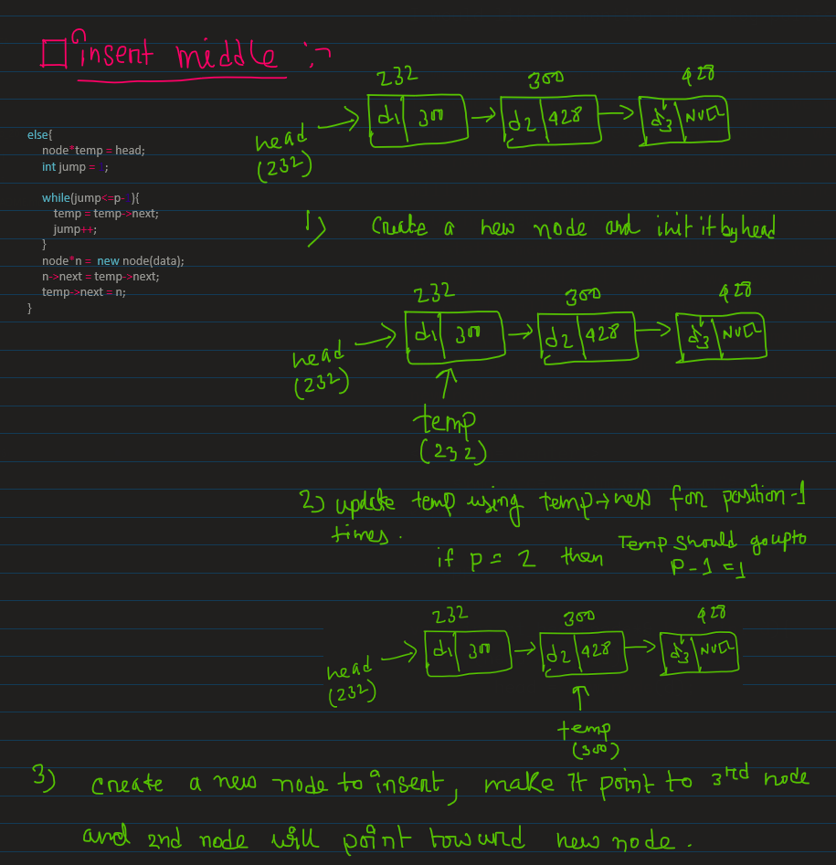

# Things I learned in: Day_11
**Note:** use the github provided TOC for navigaing.
## LL code breakdown:
### node class:
```cpp
//defining the node
class node(){
public:
    int data;
    node* next;
 
    //constructor
    node(int d){
        data = d;
        next = NULL;
    }
};
```
### How to insert at head of LL:
I would like to mention three key points of LL own implementation,

- we pass the head by reference, because if we dont do that, then we will loos the address stored in the head when we will update it. 
- by using `node* head = new node(d)` we are actually storing the address of the newly created node. Everytime when we will use `node* temp = node(d)` it will give the address of that created node.
- using `new node(d)` and `node(d)` are different, `node(d)` will crete a node in static memory, bcoz of this fact we wont be able to find this node next time we try to update it. And if we use `new node(d)` then it will be using dynamic memory to allocate the node, so no faire of missing the created node.
- concept of `insert_head()` is simple, if the head passes in the function is NULL then create a node and give its address to head and return, else create a new node and assigned its address to it and update the head.
- if we do `node* abcd = new node(d)`, this means that address of the node box lies in the abcd pointer.

<p align="center">
    
</p>

```cpp

void insert_head(node*& head,int d){    //passing by reference 
    if(head == NULL){
        head = new node(d);             // creating node in dynamic memory
                                        // which only returns the address of
                                        // created node
        return;
    }

    node *n = new node(d);
    n->next = head;
    head= n;
}
// driver code
int main(){
    node* head = NULL;
    insert_head(head,1);
    insert_head(head,2);
        
    print_ll(head);                     // prints-> 2, 1,
}
```

### insert_middle:
- position `p` is equal to 0, or `head == NULL` then perform `insert_head`, if pis grater than or equal to length of the linkedlist then perform `insert_tail` else, perform `insert_middle`.
- create a temp vatiable which starts with head, make it jump p-1 times, and bring it in the p-1 position, then create a new node and make it point to the pth node and make p-1th positioned node to point to the new node.

<p align="center">
    
</p>

```cpp
void insert_middle(node*&head,int data,int p){

    if(p==0){
        insert_head(head,data);
        return;
    }
    else if(p>=length(head)){
        insert_tail(head,data);
        return;
    }
    else{
        node*temp = head;
        int jump = 1;
        
        while(jump<=p-1){
            temp = temp->next;
            jump++;
        }
        node*n =  new node(data);
        n->next = temp->next;
        temp->next = n;
    }
    return;
}
```
### searching:
```cpp
// search using iterative approach
bool search(node* head,int key){
    node* temp = head;
    while(temp->next==NULL){
        if(head->data == key){
            return true;
        }
    }
    return false;
} 

// search: search using recursion where we return the address of the desired key
node* search_recursion(node*head,int key){
    if(head==NULL){
        return NULL;
    }
    if(head->data==key){
        return head;
    }
    else{
        return search(head->next,key);
    }
}

// search: search using recursion, returns the presence of the key using bool 
bool search_recursion_bool(node*head,int key){
    if(head==NULL){
        return false;
    }
    if(head->data==key){
        return true;
    }
    else{
        return search(head->next,key);
    }
}
```
### insert_tail:
```cpp
void insert_tail(node*&head,int data){

    if(head==NULL){
        head = new node(data);
    }
    else{
        node*temp = head;
        while(temp->next!=NULL){
            temp = temp->next;
        }
        temp->next = new node(data);
    }
}
```
### deletion:
```cpp
void delete_head(node* head){
    node* temp = head->next;
    delete head;
    head = temp;
}
```
### print:
```cpp
// printing the ll
void print_ll(node* head){   // at the print time we dont pass by reference
    while(head!=NULL){
        cout<<head->data<<", ";
        head = head->next;
    }
    cout<<endl;
}
```
### length:
```cpp
int length(node *head){
    int len=0;
    while(head){
        len++;
        head = head->next;
    }
    return len;
}
```
### take input from user:
```cpp
// 

node* take_input(){
    int d;
    cin>>d;                     // taking the data
    node* head = NULL;          // creating the head pointer

    while(d!=-1){              // - + untill user provides -1 as the input we ill keep taking input from user 
        insert_head(head,d);   //   | and insert in the head(we can use other insert operations too)
        cin>>d;                //   | and take input from the user, which will eventually update d.
    }                          // - +
    return head;               // we return head as we are not taking head in the function input.
}

// driver function
int main(){
    node* head = take_input();
    print_ll(head);
}

// take input from input.txt
node* take_input_txt(){
    int d;
    node* head = NULL;

    while(cin>>d){
        insert_head(head,d);
    }

    return head;
}

```
### Floyd's Cycle for cycle detection:
- we have two variable fast and slow, fast and slow both starts from the same place but fast jumps by 2step but slow takes only 1 steps ata a time. 
- concept is, if there is a cycle present in the ll then the fast and the slow ll will meet at some point of time.
```cpp
bool detect_cycle(node* head){
    node* slow = head;
    node* fast = head;

    while(fast!=NULL && fast->next !=NULL){
        fast = fast->next->next;
        slow = slow->next;
        if(fast==slow){
            return true;
        }
    }
    return false;
}
```

### cycle removal or break cycle:
- for break the cycle you need to make the node with 7 point to NULL. you have to do `p->next = NULL`.
- when slow and fast meets at that time put the slow and the fast pointer at the head of ll and make slow and fast take only one step at a time.
- floyed proved that x and z is equal.
- **Proof**,
    + distance traveled by slow is D_slow = x + y and distance traveled by fase D_fast = x+2y+z, and we also know that distance traveled by y is twice as much as distance traveled by x means (D_fast = 2 * D_slow).
    ```
    we know,
    D_fast = 2 * D_slow
    => x+2y+z = 2* x + 2*y
    => x = z(proved)
    ```

<p align="center">
    
</p>

```cpp
// head - Head pointer of the Linked List
// Return a boolean value indicating the presence of cycle
// If the cycle is present, modify the linked list to remove the cycle as well
bool floydCycleRemoval(node *head)
{
    /* Code here */
    node *slow = head;
    node *fast = head;

    while (fast != NULL && fast->next != NULL){

        fast = fast->next->next;
        slow = slow->next;

        if (fast == slow) {
            fast = head;
            
            while(slow->next != fast->next)
            {
                slow = slow->next;
                fast = fast->next;
            }
            slow->next=NULL;

            return 1;
        }
    }

    return 0;
}
```
## Doubly LinkedList:
Doubly linked list is similar to singly ll but it also points to the previous node, it has two boxes which stores the addtess of previous and next node and another box stores the data. It helps to interate over a linkedlist.
<p align="center">
    
</p> 


## Circular Linked List:
- In this case last node points to head, instade of pointing to NULL.
- To insert anything in a circular LL we 1st make the last node point at the new node, and new node points at the 1th node, and finally make the new node as head, by updating the head variable.
<p align="center">
    
</p> 
- when you insert the 1st node, you make a self loop like below.


```cpp
void insert(node*& head, int data){
    node* n= new node(data);
    node* temp = head;

    n->next = head;
    if(temp!=NULL){
        while(temp-> next!=head){
            temp = temp->next;
        }
        temp->next = n;
    }
    else{
        n->next = n;
    }
    head = n;
}
void print(node*head){
    node* temp = head;
    while(temp->next!=head){
        cout<<temp->data<<" ";
        temp = temp->next;
    }
    cout<<temp->data<<endl;
    return;
}
int main(){
    node* head = NULL;
    insert(head,3);
    insert(head,4);
    insert(head,5);
    insert(head,6);

    print(head);
}
```
## deletion in circular LL:
-  1st search the element using the element data, then get its address and delete it, it its head then pass the head to the next node.
- there is actually two part, as shown in the image,
    + if the node to be deleted is other than head,
    + if the node to be deleted is head
<p align="center">
    
</p>

```cpp
// find a node
node* search_node(node*head,int data){
    node* temp = head;
    while(temp->next!=head){
        if(temp->data == data){
            return temp;
        }
        temp = temp->next;
    }
    if(temp->data == data){
        return temp;
    }
    return NULL;
}
void delete_node(node*&head,int data){
    node* del = search_node(head,data)
    if(del==NULL){
        return;
    }
    //otherwise
    if(head==del){
        head = head->next;
    }
    node*temp = head;
    //stop one step behind the node to be deleted
    while(temp->next!=del){
        temp = temp->next;
    }
    temp->next = del->next;
    delete del;

}
int main(){
    node* head = NULL;
    insert(head,3);
    insert(head,4);
    insert(head,5);
    insert(head,6);
    delete_node(head,5);
    print(head);
}
```
### LinkedList STL:
forward_list is singly linkedlist and normal list is actually doubly linkedlist
```cpp
#include <list>
int main(){
    // input in list
    list<int> l;
    list<int> l1{1,2,3,4,5};
    list<string> l2{"apple","sony","hello"};
    // push back pushes any elemt at the back
    l2.push_back("vivo");

    // reverse reverses the order
    l2.reverse();
    // this sorts the linkedlist
    list.sort();
    // front() helps to get the 1st element
    cout<<l2.front()<<endl;
    // pops out the 1st element from front
    l2.pop_front();
    // pushes at the front
    l.push_front("oppo");
    // get the back of ll
    cout<<l2.back()<<endl;
    // push any element at the back of the linked list
    l2.pop_back();

    // use iterator base loop to inerate through a ll
    for (auto it=l2.begin();it!=l2.end();it++){
        cout<<(*it)<<endl;
    }
    // again push back
    l2.push_back("samsang")
    l2.push_back("one plus")
    // again remoev
    l2.remove("oppo");
    // for each loop for iterating through a ll
    from(string s:l2){
        cout<<s<<endl;
    }
    // erase one or more element
    auto itr = l2.begin();
    it++;          // as direcr access does not work with ll, so we use this 
                   // to get the next node
    l2.erase(it);   // erase any elemnt by passing the iterator

    // again for each
    from(string s:l2){
        cout<<s<<endl;
    }
    //insert element in the list after 1st element
    it = l2.begin();
    it++;
    // insert at the position(mentioned by the it, which is a iterator)
    l2.insert(it,"nokia");
    // again for each loop
    from(string s:l2){
        cout<<s<<endl;
    }
}
```
