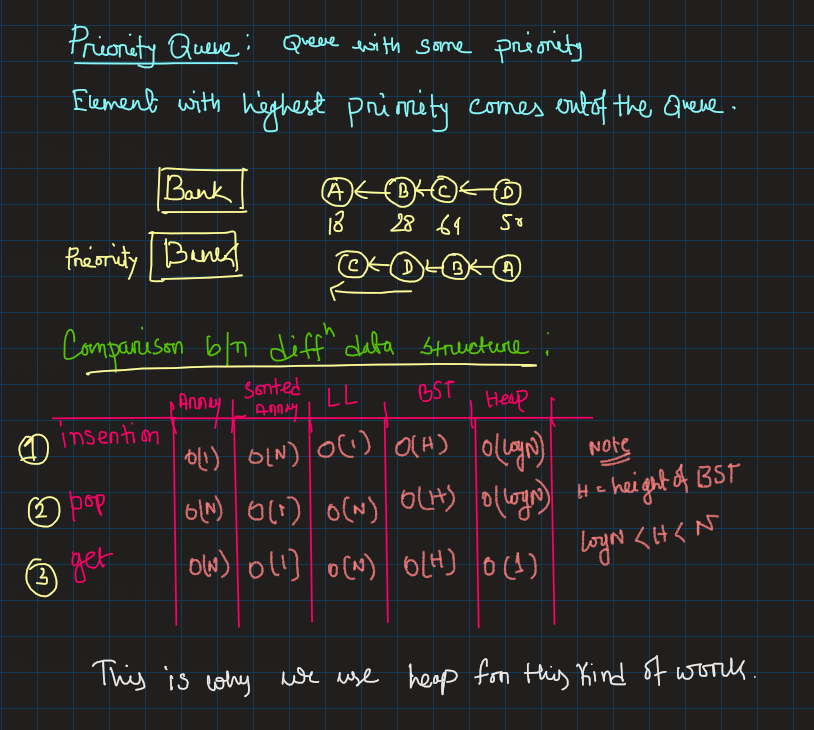
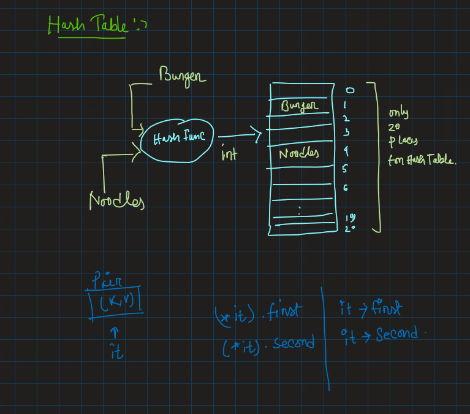

# Things I learned in: Day_14
**Note:** use the github provided TOC for navigaing.

there is also a data structure called sorted array.
## Motivation for Heap:
example of the problem that heap solves, 10k students appeared for a coding contest. Find the top 10 students.

- say you have array of these elements => {23,1,5,2,6,8}, and you want to pop a elelment(here 23 will get poped) and say you want to perform `get` operation this will give you 8 as 23 is poped out. So when you perform pop/get operation then a kind of sub operation happens(in our case it is max operation among the n numbers) then you pop/get the max element. This sub operation can be anything,but in our case it is finding the max, operation.
- in array you need to do linear search for max element,then you can pop/get, that why it is a O(N) complexity. In case of sorrted array at the time of inserting element you need to compare that element with the other elements and perform shift operation accordingly that insertion in sorted array is O(N). Incase of BST you need to travel up to a sertain position to insert or pop or get. But heap does that in O(logN) for insertion and pop and O(1) for get. 

## What is heap:
1. it is a binary.
2. It should be a complete binary tree(CBT).(n.b: if all level of the tree are complet;y filled except last level, but filling should be left to right order.)
3. Heap order property, maxheap and min heap.Heap order property for max/min says, every parent node in the heap will have high/low value than its children.

<p align="center">
    
</p>

## Hash Table:
- It is an array of fixed size table
- Array elements indexed by a key, which is mapped to an array index(0 to table-1)

<p align="center">
    
</p>

### Perpose:
- To support insertion,deletion and search in average-case constant time.
    + Assumption: Order of elements irrelevant
    + data structure **Not** useful for if you want to maintain and retriev some kind of an order of the elements.

### Hash function:
- Hash["string key"] ==> integer value

### Key Components:

- Hash Function(to convert the quer in integer)
- Hash Table (with a limited size)
- Collision Handeling Scheme 

## Map STL:
sometimes we need to store data in a key and value pairs, at that time we use map. There are two type of maps 1. ordered map, 2. unordered map
```cpp
int main(){
    map<string, int> m;

    //insert_1
    m.insert(make_pare("mango",100));
    //insert_2
    pair<string,int> p;
    p.first = "apple";
    p.second = 120;
    m.insert(p);
    //insert_3
    m["Banana"] = 20;

    // serach for an element
    string fruit;
    cin>>fruit;

    auto it = m.find(fruit); // auto can be replaced by mapstring,int>::iterator
    if(it!=m.den()){
        cout<<"price of "<<fruit<<" is "<<n[fruit]<<endl;
    }
    else{
        cout<<"fruit is not present"<<endl;
    }
    //another special property
    // it stores key only ones, so m["banana"] = 10 will update the value of banana

    // alternative a count func
    if(m.count(fruit)){
        cout<<"price of "<<fruit<<" is "<<n[fruit]<<endl;
    }
    else{
        cout<<"fruit is not present"<<endl;
    }
    // erase key, will remove the key value from the map
    m.erase(fruit);
    m["litchi"] = 60;
    m["pineapple"] = 20;

    for(auto it=m.begin();it!=m.end();it++){
        cout<<it->first<<" and "<<it->second<<endl;
    }
    for(auto p:n){
        cout<<p.first<<" : "<<p.second<<endl;
    }
}
```

## Unorderedmap STL:
Unordered maps are same as maps but in case of unordered it dont stores the elements in a ordered manner. The STL part is same a map, just need to import unordered_map library, and change the map instance by unordered_map. In this cas insertion,deletion and finding happens in O(1) time.


