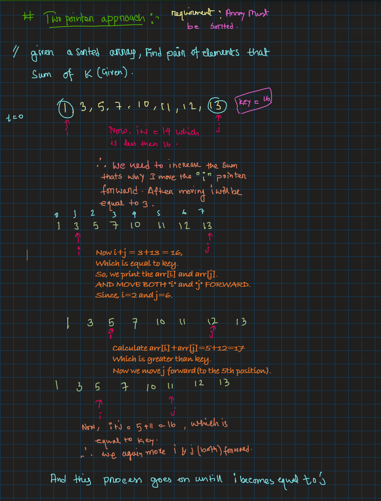
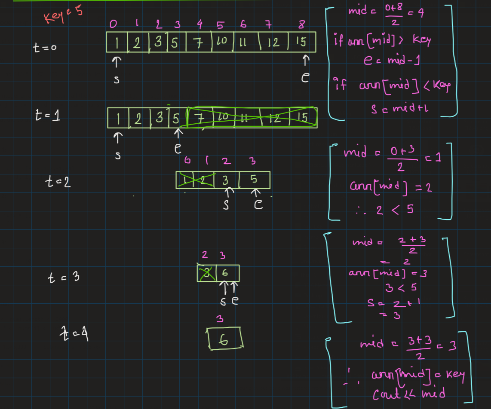

# Things I learned in: Day_19
**Note:** use the github provided TOC for navigaing.

# Two pointer:
main concept of two pointer is if current sum is not equal to 

<p align="center">
    
</p>


```cpp
int main(){
    int arr[1000] = {1,2,3};       // array should be sorted
    int n = 3;
    int key;
    cin>>key;

    for (int i = 0; i < n; ++i){
        /* code */
        cin>>arr[i];
    }

    int i = 0;
    int j = sizeof(arr)/sizeof(int);
    while(i<j){
        int current_sum = arr[i] + arr[j];
        if(current_sum>key){
            j--;
        } 
        else if(current_sum<key){
            i++;
        }
        else{
            cout<<arr[i]<<" "<<arr[j];
            i++;
            j--;
        }
    }
}
```

## Binary search:
<p align="center">
    
</p>
```cpp
int binary_search(int a[],int n,int key){
    int s=0;
    int e = n-1;
    while(s<=e){
        int mid = (s+e)/2;
        if(a[mid]==key){
            return mid;
        }
        else if(a[mid]>key){
            e = mid-1;
        }
        else{
            s = mid + 1;
        }
    }
    return -1;
}
```
