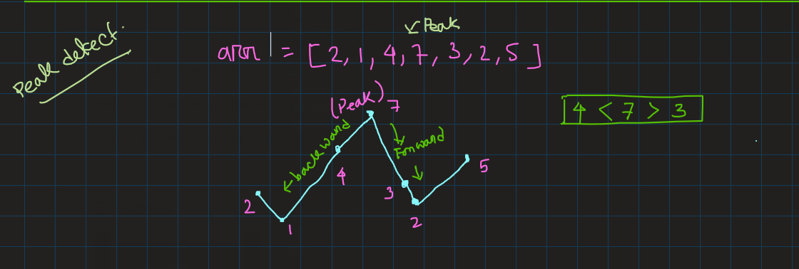

# Things I learned in: Day_20
**Note:** use the github provided TOC for navigaing.

# mountain array:
https://youtu.be/rh2Bkul2zzQ
main key of this problem, or any problem which involves mountains and peks, is first detecting the peak.
And peak is dfined as `arr[i-1]<arr[i]>arr[i+1]`, means at that, peak is the position where left and right elements are smaller than the peak element.

    

then we travers backward from the peak to find the left most element and travers the forward from the peak to get the right most elementof the mountain.and keep a max_len and current_len, if current_len>max_len then make max_len = current_len.

constrains: always remember the 1st element of the array cant be the peak, and we dont take last element of the array consideration as two element cant make a mountain.
