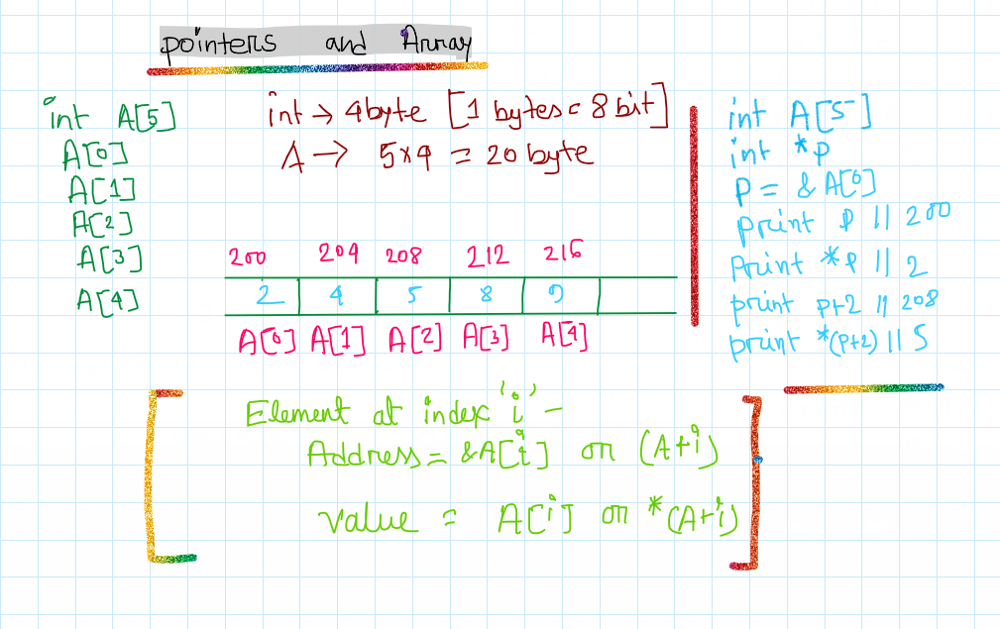

# Things I learned:

## `&` operator in c++(*pointer 1st video*):
`&` operator provides address of a mentioned variable. But it dont work for charecter type variables.

**For int type:**
```cpp
int main(){
    int intgr = 3;
    cout<<&intgr;
}
```

**For float type:**
```cpp
int main(){
    float flat = 13.2;
    cout<<&flat;
}
```
**For cahr type:**
```cpp
int main(){
    char charecter = 'A';
    cout<<&charecter; 
}
```
This will output `A`, because if you pass address of a char type variable in `cout<<` then it returns the stored object in variable itself. 

**Solution:**
`&charecter` has a type of `char*` and we need to change it to `void*` using typecasting. By doing that `cout<<` dont get to know what type of address it is, so it prints the address.
```cpp
int main(){
    char charecter = 'A';
    cout<<(void*)&charecter; 
}
```

## Pointers:
**Pointer is a variable which stores address of another variable.**

<p align="center">
    
</p>

Data type of the pointer variable should be same as the main variable.
**Size of a Pointer variable:**

The size of a pointer in C/C++ is not fixed. It depends upon different issues like Operating system, CPU architecture etc. Usually it depends upon the word size of underlying processor for example for a 32 bit computer the pointer size can be 4 bytes for a 64 bit computer the pointer size can be 8 bytes. So for a specific architecture pointer size will be fixed.
<br>
It is common to all data types like int *, float * etc.

PS: Read about ` Dereference Operator`.

# Array Pointers:
<p align="center">
    
</p>


```cpp
int A[] = {2,4,5,8,9};
int *ptr;

prt = A  
cout<<ptr<<" "<<A; // Address of A[2] -> the 1st element

cout<<*ptr         // Prints the element stored in A[2], 
                   //its called dereferencing

cout<< ptr+1;        // prints the address of 2nd element

cout<<*(ptr+1)       // prints the 2nd element
```
In array pointer, you stores the address of the 1st element by providing the array name(here its `A`) in an pointer array. Then to access the other elements by incrementing the pointer and dereferencing it one by one (I mean `*(p+1)`). Dereferencing means adding `*` with a pointer variable. This helps to get the element stored.

##  Passing array in a function:
```cpp
void fun(int *arr,int n){
    ...
}
int main(){
    fun(arr, n);
}
```

## Passing a variable in a function:
```cpp
void fun(int *x){
    ...
}
int main(){
    fun(&x);
}
```


