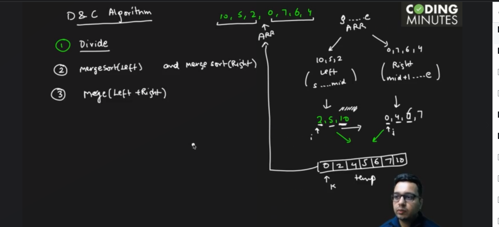
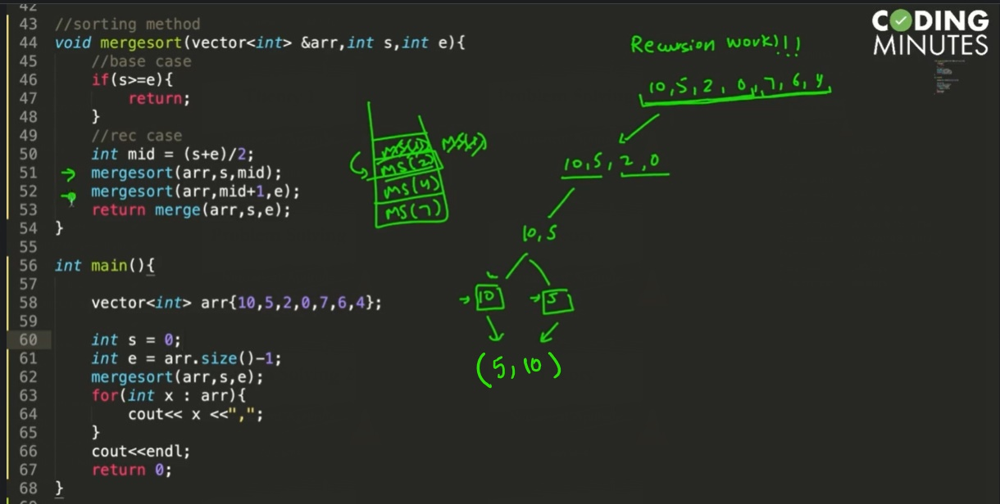
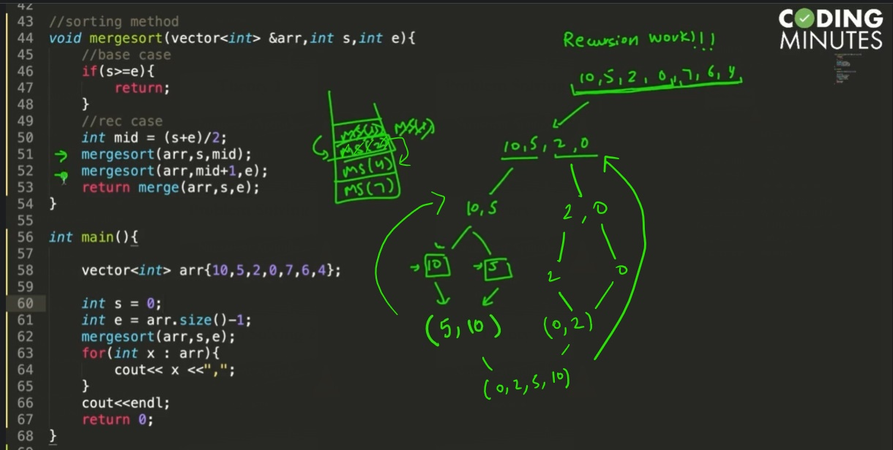
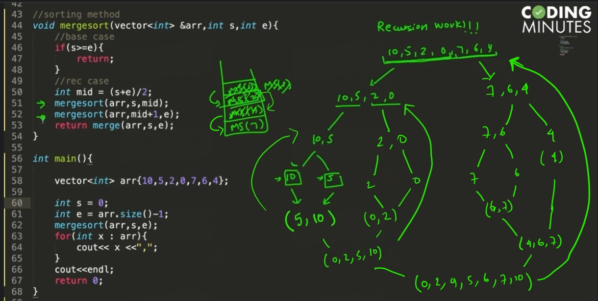
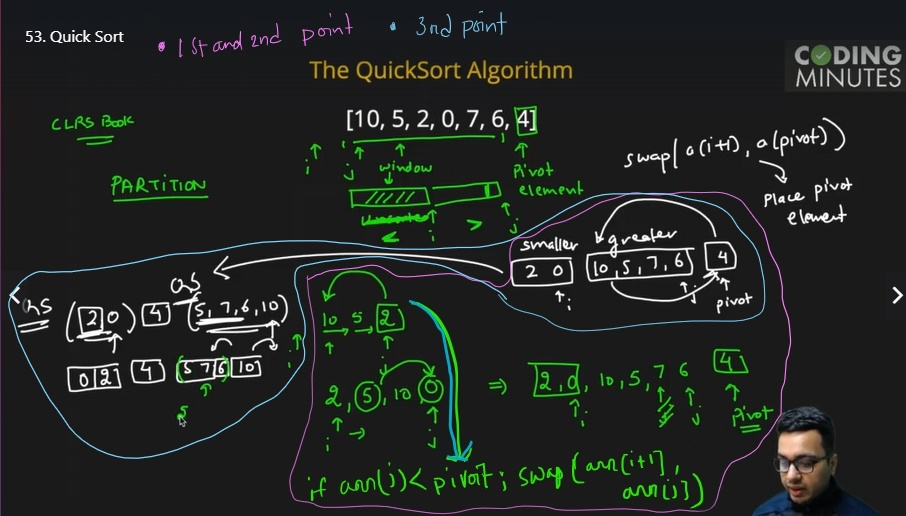
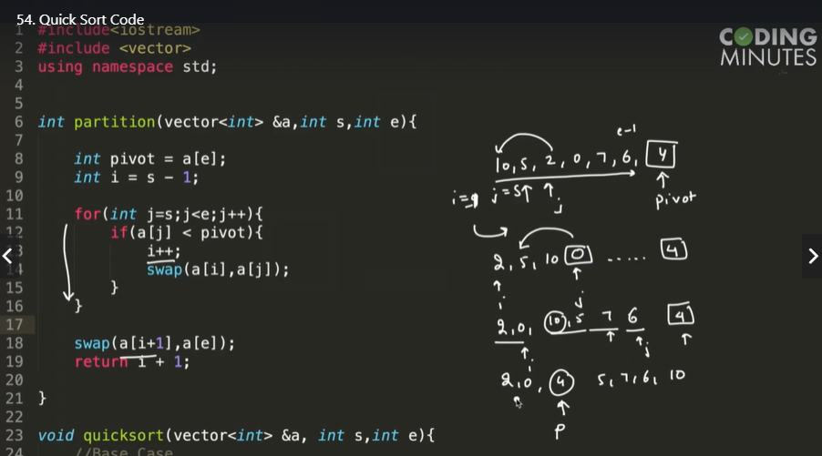

# Things I learned in: Day_31
**Note:** use the github provided TOC for navigaing.

# Merge sort:
> recursive, divide and conquer

1. Divide the array by the middle point
2. sort the both left and the right part recursively.
3. merge both sorted array into a single array. 



```cpp
if(s>=e){
    return;
}
mergesort(arr,s,mid);    --->1
mergesort(arr,mid+1,e);  --->2
return merge(arr,s,e);   --->3
```

(1) is called untill the base case is full filled(means s==e, at the element 10).when it full fills the base case the (2) line gets executed,it also gets called untill it hits the base case(at the element 5). Then the line (3) gets executed and both the sorted arrays get merged. And this process continues untill the stack calls are done.





# Quick Sort Algo:
Eg: sort this array -> [10,5,2,0,7,6,4] 

1. **choose a pivot**(its besically the point where we are gonna divide the array) - last element of the array. Here pivot is 4.
2. **Partition:** we will get all the points less than pivot in the left and values greater than pivot in the right. After partition it will be like-> 
[2,0], [4], [5,10,7,6]
3. **then recursively sort left and right part.**



```cpp
//Base Case
if(s>=e){
    return;
}
//Rec Case
int p = partition(a,s,e);  ->// 1
quicksort(a,s,p-1);        ->// 2 (sort left part of pivot)
quicksort(a,p+1,e);        ->// 3 (sort right part of pivot)
```

This img explains how the partition function is working.




