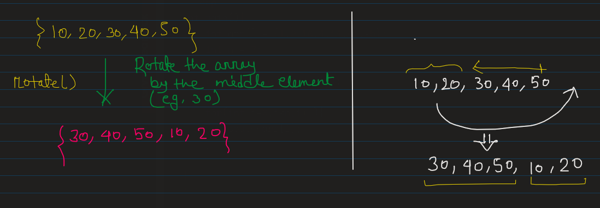
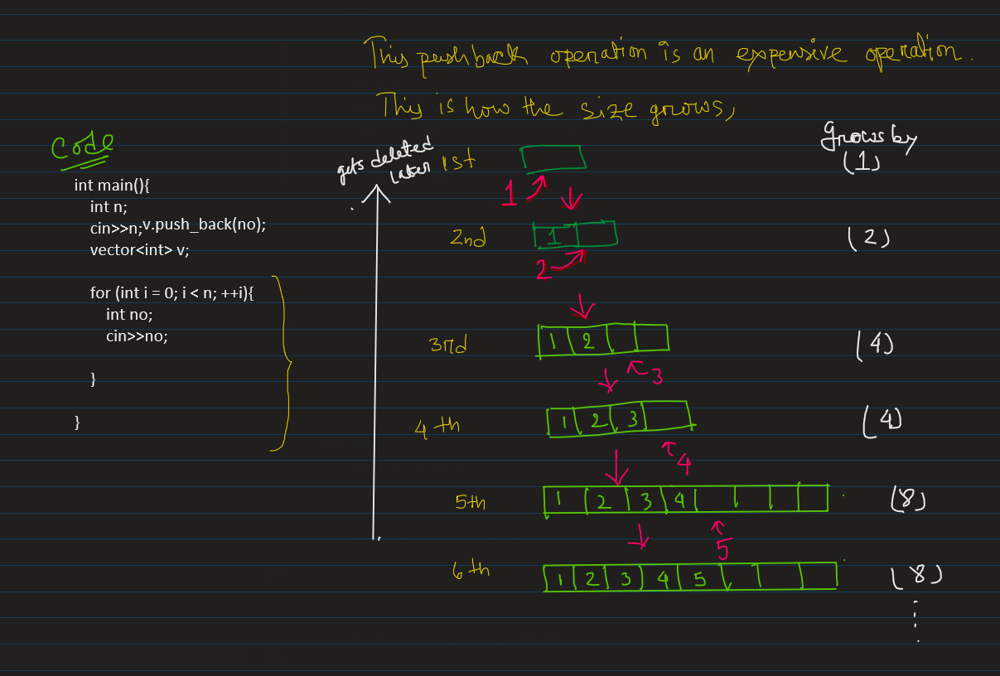

# things I learned in Day 6:
**Note:** use the github provided TOC for navigaing.


## `rotate()` function:
- rotate an array from a perticular element, say, there is an array {1,4,2,5,6} and you want to rotate it by the middel element(which is 2).so if you pass that array through `rotate()` then it will give you {2,5,6,1,4}.

<p align="center">
    
</p>

```cpp
int main(){
    int arr[] = {1,2,10,4,14,41,-5};
    int n = 7;
    
    rotate(arr,arr+3,arr+n);            

    for(int i=0;i<n;i++){
        cout<<arr[i];                   //4, 14, 41, -5, 1, 2, 10, 
    }

}
```

## use `next_permutation()` function:
- use this func to rearrange the elements of an array.
```cpp
int main(){
    int arr[] = {1,2,3};
    int n = 3;
    
    next_permutation(arr,arr+n);            

    for(int i=0;i<n;i++){
        cout<<arr[i];                   //1,3,2 
    }

}

```

## use `swap()` func:
```cpp
int main(){
    int a=2;
    int b=7;

    swap(a,b);                  // swap the elements of a,b

    cout<<a<<" "<<b;
}
```

## use `min()` and `max()`:
- `min()` gives the min element b/w a and b.
- `max()` gives the max element b/w a and b.
```cpp
int main(){
    int a=2;
    int b=7;

    int min = min(a,b);                  // gives the min element b/w a and b

    int max = max(a,b);                  // gives the max element b/w a and b
    
    cout<<min;
    cout<<max;
}
```

## use `reverse()` func:
- reverse a sub part of an array or the whole array.
```cpp
int main(){
    int arr[] = {1,2,3};
    int n = 3;
    
    reverse(arr,arr+n);                  // reverses the whole array
    reverse(arr,arr+2);                  // reverses 1st two elements of the arr
    

}
```

## `pair` class:
- pairs are use full container for storing heteroginious elements.
```cpp
int main(){
                                        
    pair<int,char> p;                                  //1st way
    p.first = 10;                  // access the 1st elements using p.firse
    p.second = 'B';                // access the 2nd elements using p.second

    
    pair<int,char> p2(p);                              //2nd way
    cout<<p2.first<<" "<<p2.second;

    
    pair<int, string> p3 = make_pair(100,"group");     //3rd way

    
    pair<pair<int,int>,string> car;                    //4th way
    car.second = "tata";
    car.first.first = 100;
    car.second.second = 200;

}

```
# vector:
## create a vector

- Vector grows itself by double of its length, when all the elements gets pushed to the vector. Say you have a vector of size 4 and if all the 4 spaces gets filled up then it will make its size 8. It is managed by vector class itself.

```cpp
int main(){
    //ways to create a vector
    vector<int> a;
    vector<int> b(5,10);                   // five int with value 10- init a
                                           //  vector consists of n zeros (n,0)
    
    vector<int> c(b.begin(),b.end());      // copy all the elements of vector b

    vector<int> d{1,2,3,4,5,6};

}

```
## How to eterate over the vector
```cpp
int main(){
    //ways to create a vector
    vector<int> a;
    vector<int> b(5,10);                   // five int with value 10- init a
                                           //  vector consists of n zeros (n,0)
    
    vector<int> c(b.begin(),b.end());      // copy all the elements of vector b

    vector<int> d{1,2,3,4,5,6};

}

```
## iterate over vector
```cpp
int main(){
    vector<int> v{1,2,3,4,5,6};
    int n = v.size();

    // use simple for loop
    for(int i =0;i<n;i++){
        cout<<c[i] << ", ";                // 1, 2, 3, 4, 5, 6 
    }


    // use iterator, replace `auto` with -> std::vector<>::iterator
    for ( i = .begin(); i != .end(); ++i){
        cout<<(*i)<<", ";                  // 1, 2, 3, 4, 5, 6 
    }

    // for each loop
    for(int x:v){
        cout<<x<<", ";                     // 1, 2, 3, 4, 5, 6
    }
}
```
you can use simple foor loop or vector for loop or for each loop to iterate over a vector.

## take user input in a vector
```cpp
int main(){
    int n;
    cin>>n;
    vector<int> v;
    for (int i = 0; i < n; ++i){
        int no;
        cin>>no;
        v.push_back(no);                  // adds element to the end of the 
                                          // vector (just know this)
    }


}

```
- different ways of knowing the size of a vector
```cpp
int main(){
    vector<int> v;
    

    cout<<v.size()<<endl;                 // how many elements you are holding
    
    cout<<v.capacity()<<endl;             // capacity of the vector

    cout<<v.max_size()<<endl;             // what is the largest possible array 
                                          // that your currenet memory can hold 

}

```
## Various methods availsble in vector header
#### `push_back()` and `pop_back()` method:
```cpp
int main(){
    vector<int> v{1,2,3,4,5,6};
    //its O(1)
    v.push_back(7);                        // inserts 7 at the back

    //its also O(1)
    v.pop_back();                          // remove element from the back

}
```

#### `.insert()` ,`erase()`, `clear()` and `empty()` method:
it has O(N).
```cpp
int main(){
    vector<int> v{1,2,3,4,5,6};

    v.insert(v.begin() + 3,100);           // insert 100 at the 3rd position

    v.insert(v.begin() + 3,4,100);         // inserts 100 from the 3rd 
                                           // position for 4 times

    // erase operation
    v.erase(d.v.begin()+2);                // will erase/remove the 2nd element

    v.erase(d.v.begin()+2,d.v.begin()+5);  // erase elements within a range

    // clear op
    v.clear()                               // will remove all elemrnts 

    // empty or not
    if(v.empty()){
        cout<<"its a empty vector";         // check vector is empty or not
    } 

}

```
#### `resize()` an element:
```cpp
int main(){
    vector<int> v{1,2,3,4,5,6};
    v.resize(8);
}

```

#### `fromt()` method:
```cpp
int main(){
    vector<int> v{1,2,3,4,5,6};

    cout<< v.front()<<endl;                 // get the 1st element 
    cout<< v.back()<<endl;                  // get the last element
}

```
#### using `v.push_back()` is an expensive operation, use `reserve()`:
- as it need to make copy of itself when it gets filled (previous one gets deleted though). copying is an time taking operation.
<p align="center">
    
</p>
- inorder to avoid this we need to use `reserve()`

```cpp
int main(){
    vector<int> v{1,2,3,4,5,6};
    v.reserve(1000);                        // to reserve the capacity
    
    for (int i = 0; i < n; ++i){
        int no;
        cin>>no;
        
        v.push_back(no);                  // adds element to the end of the 
                                          // vector (just know this)
                                          // this time capacity will be same and unchanged.
    }

}

```
#### slicing operation in vector class:
- slicing can be done in many ways,
1. by copying a vector to another, here v got coppied in d.
```cpp
int main(){
    int n;
    cin>>n;
    vector<int> v{1,2,3,4,5,6};
    
    vector<int>d(v.begin()+1,v.begin()+4);

    for(int x:d){
        cout<<x<<", ";
    }
}
```
- using another function but using the same copy method
#### see how to pass vector to a function:
```cpp
// C++ program for the above approach
#include "bits/stdc++.h"
using namespace std;
  
// Function to slice a given vector
// from range X to Y
vector<int> slicing(vector<int>& arr,
                    int X, int Y)
{
  
    // Starting and Ending iterators
    auto start = arr.begin() + X;
    auto end = arr.begin() + Y + 1;
  
    // To store the sliced vector
    vector<int> result(start,end);
  
    // Copy vector using copy function()
    // copy(start, end, result.begin());
  
    // Return the final sliced vector
    return result;
}
  
// Function to print the vector ans
void printResult(vector<int>& ans)
{
  
    // Traverse the vector ans
    for (auto& it : ans) {
  
        // Print elements
        cout << it << ' ';
    }
}
  
// Driver Code
int main()
{
  
    // Given vector
    vector<int> arr = { 1, 3, 4, 2,
                        4, 2, 1 };
  
    // Given range
    int X = 2, Y = 5;
  
    // Function Call
    vector<int> ans;
    ans = slicing(arr, X, Y);
  
    // Print the sliced vector
    printResult(ans);
}
```
#### use templates for vector for slicing:
```cpp
// Template class to slice a vector
// from range X to Y
template <typename T>
vector<T> slicing(vector<T> const& v,
                  int X, int Y)
{
  
    // Begin and End iterator
    auto first = v.begin() + X;
    auto last = v.begin() + Y + 1;
  
    // Copy the element
    vector<T> vector(first, last);
  
    // Return the results
    return vector;
}
  
// Template class to print the element
// in vector v
template <typename T>
void printResult(vector<T> const& v)
{
  
    // Traverse the vector v
    for (auto i : v) {
        cout << i << ' ';
    }
    cout << '\n';
}
```

