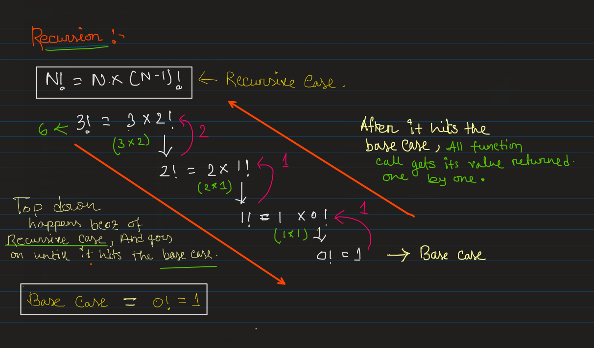
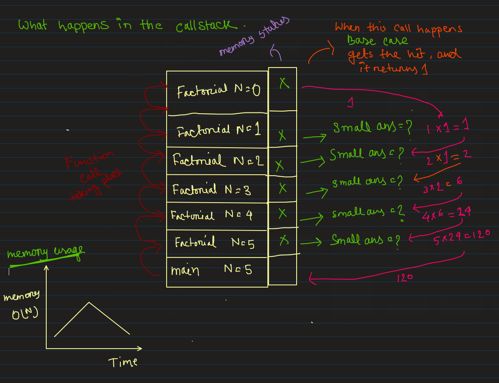

# Things I learned in Day 7:
**Note:** use the github provided TOC for navigaing.

## Recursion(I-Basics):

### Technique to solve Recursive problems:
There is two parts of recursive solution,

- Base Case (other wise program will keep on running untill it hits the memory limit, in other words its called **segmentation fault**). Base case is nothing but the smallest basecase, which is known to us. Like in factorial we know 0! = 1, or in calculating power of a number we know n^0 = 1(for power =0, it will always return 1).
- Recursive case ( works toward base case) 
```
===============================================================================
|Easiest way to Approach Recursion problems                                   |
|"Magical" Recirsion Rule = "Principal of Methematical Induction(PMI)"        |
===============================================================================
| 1. Figure out the base case. There can be multiple base cases               |
| 2. Assume Sub Problems can be solved bu recursion (sutomatically)(IMP)      |
| 3. Using the sub-problem write the answer for the current problems.         |
===============================================================================
```

### Example:
Say you need to find factorial of 3(3!). you can solve it via recursion but you can also solve it using recursion too.

- 1st Figure out the base case, in our case it is, `Factorial(0) =1` as `0!=1`.
- 2nd Assume Sub Problems can be solved bu recursion. In our case we can assume that `Factorial(N-1)` can be computed using recursion, we need to assume this.
- 3rd Using the sub-problem write the answer for the current problems. In our case, it is `Factorial(N) = N * Factorial(N-1)`.

### Code:
```cpp
int Factorial(int n){
    //base case
    if(n==0){
        return 1;
    }
    // recursive case
    int small_ans = Factorial(N-1); 
    int factorial = n * small_ans;

    // return the calculated value
    return factorial; 
}
int main(){
    int n;
    n = 3;
    cout<<Factorial(3);
}

```
### How recursion works internally:
<p align="center">
    
</p>

As you can see in the picture, there are two calls happens, one is `top down call` and another is `bottom up call`. 

- `top down call` when execution of the recursive case happens, the function call from the recursive case keeps on happening untill it hits the `base case`. 
- And in `bottom up call`, after hitting the base case it returns the base value and the smaller problems get solved one by one untill the first call gets its value.

### How callstack works at the time of recursion:
<p align="center">
    
</p>

Function calls happens via call stack, the rectengle represents the call stack. and in thaat call stack we have main func and all the variables associated with the func are in stack memory, bcoz of that N is all the stacks, when `Factorial()` gets called a stack memory gets assigned to the `Factorial()` where N=5, then internally the afain `Factorial()` call happens(in the small_ans line) and it gets a stack memory too, but N is now 5-1=4;but value of `Factorial(4)` is unknown, so again function call happens, and this goes on untill it hit the base case, when it hit the base case it returns some value, and the stack memory gets deleted(the top memory), and this returned value gets passed to smaller problem (below stack function calls where N=1) and `small_ans` gets calculated and that stack memory gets deleted, and this keep going on untill it comes to main, and from main the value is printed.

## Imp Link:
https://dynalist.io/d/LoGwqWPmqCT3IoPxJqV2SlZp
