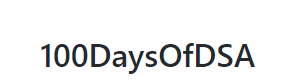
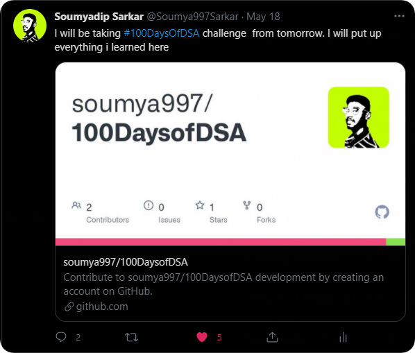

    

    

    

I have scheduled a timeline for doing the base work for DSA/CP,[here]( https://www.notion.so/soumya997/DSA-Targets-2-week-plan-689460d1ba3848b19c000f41d9c29617)
- Learn topics basic topics of cp/DSA by **3rd June**,
- practic basic problems topic wise from **4th to 15th June**.
- After that practicing continues and participation in codeforces contests and codechef contests starts.

## Topics:
This table consists only the topics that I have learned during a day. 

|Day no.| topics/Questions | Notes/Solution |
|--|--|--|
|Day 1|**Basics of Array** 1. Linear Search, 2. Binary Search, 3. Selection Sort|[Day 1](Day_1)|
|Day 2|**Basics of Array** 1. Bubble_sort, 2. generate subarray, 3. insertion sort, 4. kadane's algorithm|[Day 2](Day_2)|
|Day 3|**Pointers** 1. `&` operator in c++, 2. Pointers, 3. Array Pointers, 4. Passing array in a function, 5. Passing a variable in a function|[Day 3](Day_3)|
|Day 4|1. Charecter array, 2. String|[Day 4](Day_4)|
|Day 5|**Algo STL** 1. Use of `find()` function, 2. use of `binary_search()`, 3. use `lower_bound()` and `upper_bound()`, 4. Use `sort()` function|[Day 5](Day_5)|
|Day 6|**Algo STL** 1. `rotate()` function, 2. use `next_permutation()` function, 3. use `swap()` func, 4. use `min()` and `max()`, 5. use `reverse()` func, 6. `pair` class, **Vector** 7. create a vector, 8. iterate over vector, 9. take user input in a vector, **Various methods availsble in vector header** 10. `push_back()` and `pop_back()` method, 11. `.insert()` ,`erase()`, `clear()` and `empty()` method, 12. `resize()` an element, 13. `front()` method, 14. using `v.push_back()` is an expensive operation, use `reserve()`, 15. slicing operation in vector class, 16.see how to pass vector to a function, 17. use templates for vector for slicing|[Day 6](Day_6)|
|Day 7|**Recursion-part-I** 1. Recursion basics|[Day 7](Day_7)|
|Day 8|**C++ development** 1.How to use `CImg` library in c++, 2.  `C++` Auto-complete for Sublime text, 3. Using `print()` instade of `cout<<`, 4. resources on `Image preprocessing` from scratch using only c++, 5. Use of multiple file code splitting|[epics(Day8)](epics(Day8))|
|Day 9|**More recursion Basics** 1. Technique to solve Recursive problems, 2. Example, 3. Code, 4. How recursion works internally, 5. How callstack works at the time of recursion|[Day 9](Day_9)|
|Day 10|**Linked List** 1. Linked List basics, 2. Linked List implementation, 3. object oriented approach, 4. only function|[Day 10](Day_10)|
|Day 11|**Linked List code breakdown** 1. node class, 2. How to insert at head of LL, 3. insert_middle, 4. searching, 5. insert_tail, 6. deletion, 7. print, 8. length, 9. take input from user,  10, Floyd's Cycle for cycle detection, 11. cycle removal or break cycle, 12. Doubly LinkedList, 13. Circular Linked List, 14, deletion in circular LL, 15, LinkedList STL|[Day 11](Day_11_to_20/Day_11)|

## Questions:
Here I put the questions that are solved in daily bases with solution script and the logic.  
|Day no.| Questions | Solution |
|--|--|--|
|Day 5|[Arrays-Wave print Column Wise](Day_5/PROBLEMS.md)|[Day 5](Day_5/wave.cpp)|

## Twitter posts:
Table to see the twitter posts regarding `100DaysOfDSA` challenge. **I will try to complete my daily goals in the most regular way possible.**

|Day no.| twitter post | date(21) |
|--|--|--|
|Day 1|https://twitter.com/Soumya997Sarkar/status/1394751397657075715?s=20|May 19|
|Day 2|https://twitter.com/Soumya997Sarkar/status/1395132332303032320?s=20|May 20|
|Day 3|https://twitter.com/Soumya997Sarkar/status/1395845100345774082?s=20|May 22|
|Day 4|https://twitter.com/Soumya997Sarkar/status/1396210281429094402?s=20|May 23|
|Day 5|https://twitter.com/Soumya997Sarkar/status/1397283174820896769?s=20|May 25|
|Day 6|https://twitter.com/Soumya997Sarkar/status/1397284274479325185?s=20|May 25|
|Day 7|https://twitter.com/Soumya997Sarkar/status/1397652904756932613?s=20|May 27|
|Day 8|https://twitter.com/Soumya997Sarkar/status/1398386855289131009?s=20|May 29|
|Day 9|https://twitter.com/Soumya997Sarkar/status/1398388971206438914?s=20|May 29|

